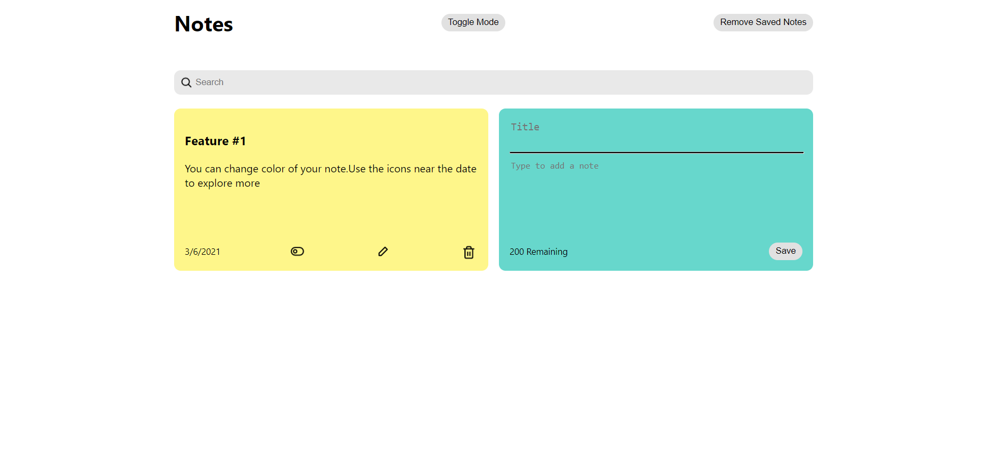
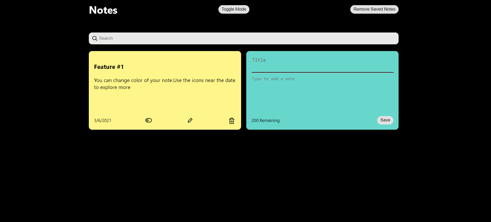

# Easynotes

Easynotes is a unique cross-platform notes web app built using ReactJS.

#### Technical Details
The app uses component based architecture along with useState hooks and props to transfer data around.
The data remains persistent across sessions due to the use of Localstorage where the data is stored in the form of json objects.

### Features:
- Add Notes
- Edit Notes
- Delete Notes
- Markdown Enabled Typing
- Search Suggestions For Notes
- Auto Save [Saves in localstorage in browser- Instant delete button provided]
- Change Color of Notes
- Dark Mode

## Why Should You Use Easynotes:
- We assure you of our best service at all times.
- Easy to use.
- keep track of deadlines
- milestone dates and other important information
- You can implement time management and productivity tools
- Manage your projects
- And so on...

## Let's take a look:

 

## Visit: 
https://rutuj-runwal.github.io/easynotes/

## THANK YOU!

